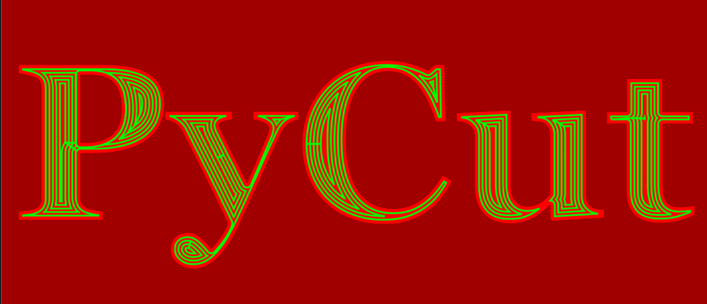

# PyCut

clone of jscut in python



Disclamer: This software is used at the user's own risk. No responsibility is accepted by its creator.

## Why PyCut

With <strong>PyCut</strong>, you do not need to do 3D modelling. SVG files (2D) are <strong>PyCut</strong> input format, and for simple milling tasks it is perfectly OK. Granted, SVG shapes (paths) definition is not so straightforward as one could think, and free software lacks good SVG paths modelling applications. Infact, writing a SVG file with a text editor is sometimes the best way. To generate complex SVG paths, other tools may be used (see Tutorial), and the results may be paste into the hand-written files.

Before starting, please have a look at the tutorial to be sure your SVG input files follow the PyCut requirements (mostly: how to define the view box; shapes must have an unique id in order to be imported in the viewer; take care if paths definitions are closed (Z) or not).

## Usage

start the program from the installation folder

```
> python pycut.py -h
> python pycut.py
> python pycut.py -p <path_to_project>
> python pycut.py -g <path_to_gcode>   # view an external gcode data
> python pycut.py -s <path_to_svge>    # load an svg file into the viewer
```

## Dependencies

- Python 3.11
- PySide6 6.8.1
- shapely 2.1.0
- PyOpenGL (latest) [3.1.9]
- svgelements (latest) [1.9.6]
- lxml (latest) [5.3.1]
- freetype-py (latest) - used in svgtext2svgpath.py utility [2.5.1]
- matplotlib (latest) - to debug/view shapely offsets ops [3.10.0]
- numba (latest) - for python simulator optimization [0.61.0]
- pyvoronoi (latest) - for HSM nibbler toolpaths [1.1.6]

## Features

- read "project" files : a file with all settings and ops for a given svg file
- select 1 or more ops in the list and "generate" Gcode -> toolpaths OK for
  - pocket YES
  - outside YES
  - inside YES
  - engrave YES
  - vPocket NO (will never be implemented - I do not need this -)
  - drill or peck YES (for circle of radius smaller than the cutter radius)
  - helix YES
- svg items selection and op creation with combinaison Union/Diff/Inter/Xor (geometry calculated)
- preview geom displayed in svg viewer
- tabs
- toolpaths displayed in svg viewer
- gcode path viewer (as in Candle)
- gcode simulator (as in jsCut, but with candle parser)
- gcode produced (GRBL)

## Main Improvments over JsCut

- tabs "on the fly" (no need to define them in the svg file)
- flip X/Y in GCode (good for my machine - the "1419" one -)
- can handle polygons as well as lines ("closed paths" and "opened paths")
-  toolpaths with HSM_nibbler optional.

See the Wiki page for more.
